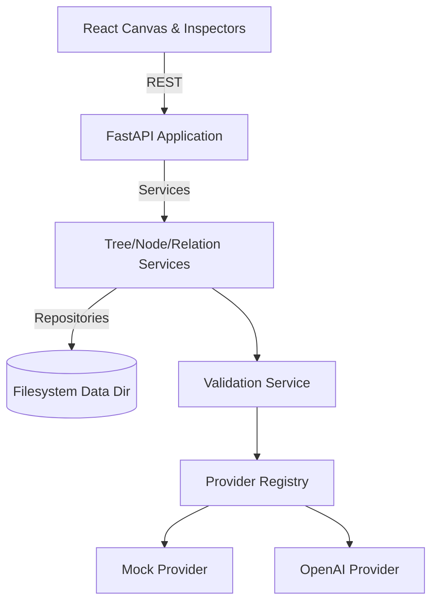
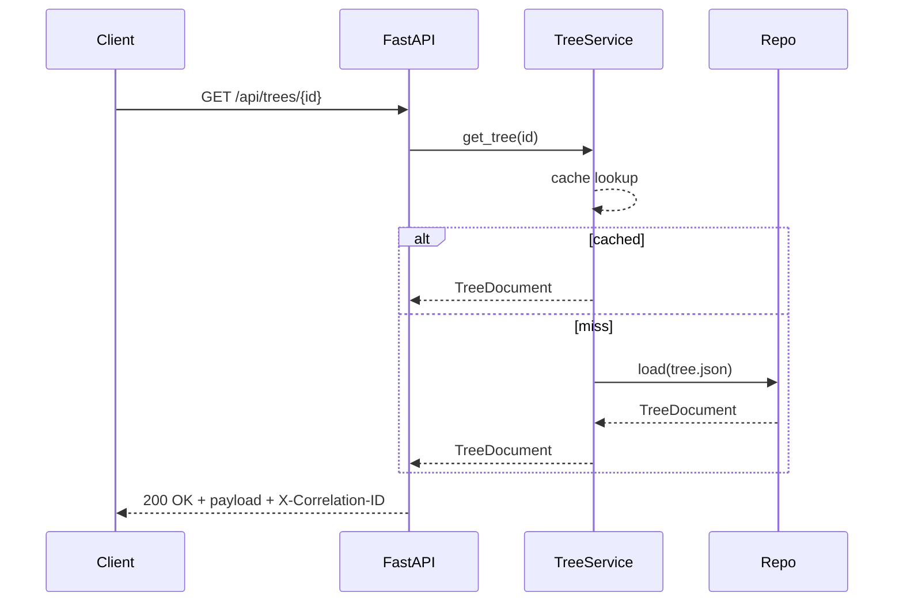

# Architecture Overview

Brain Buddy is split into a FastAPI backend and a Vite/React frontend that collaborate over a JSON REST API. Filesystem storage keeps the project offline-friendly while still supporting version history and validation workflows.

## Backend
- **Core stack**: FastAPI, Pydantic models, pytest for coverage, and filesystem repositories.
- **Caching**: `TreeService` layers an LRU cache on top of repository reads, reducing disk access for repeated `GET /trees/:id` requests.
- **Observability**: `CorrelationIdMiddleware` injects an `X-Correlation-ID` header and logging context for every request. Failures can be cross-referenced from frontend to backend logs.
- **Security placeholder**: `ApiKeyMiddleware` enforces a static API key when `BRAIN_BUDDY_API_KEY` is set. Health and documentation routes remain accessible for local automation.
- **Versioning**: repositories write version snapshots, and services ensure index synchronisation to maintain consistency.

## Frontend
- **Canvas**: React Flow renders the graph; `useGraphProfiler` logs render timings when node/edge counts change in development.
- **State management**: Zustand stores graph state with optimistic change queues and undo/redo stacks.
- **Data fetching**: React Query coordinates API reads/writes. Error toasts surface retry actions and correlation references.
- **Auth forwarding**: When `VITE_API_KEY` is set, the client forwards the configured header with every request to satisfy the backend API key guard.

## Data & Storage
- Trees, nodes, relations, and version metadata live under `backend/data/<tree-id>/` as JSON documents.
- `schema_version` in the data directory allows migrations to bump format versions without losing compatibility.
- The index repository mirrors high-level tree metadata to support list views without loading full graphs.

Further detail on request/response shapes is available in `docs/api_usage.md`, and historical requirements live in `requirements/`.
