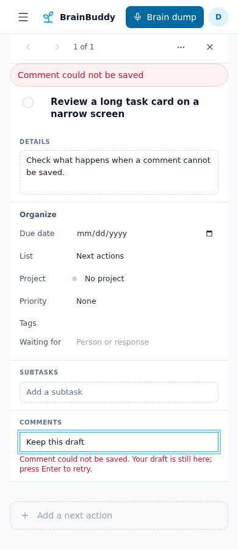
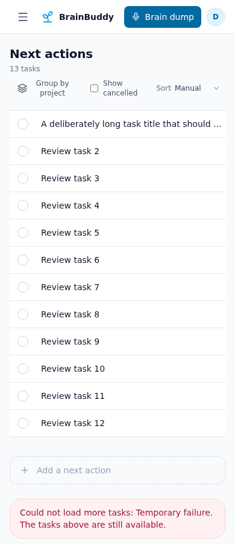
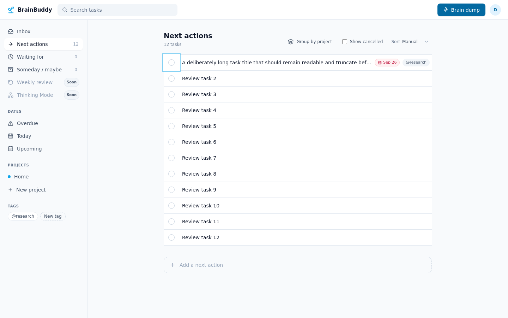
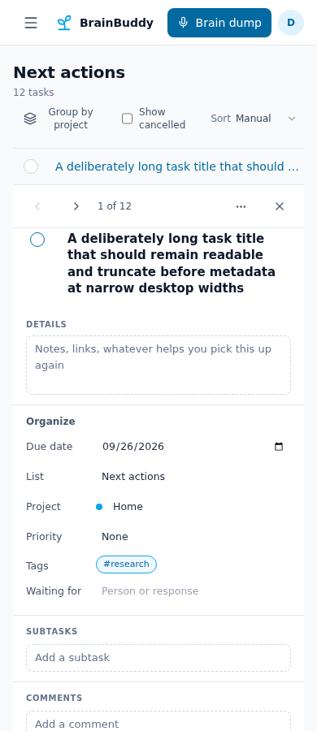
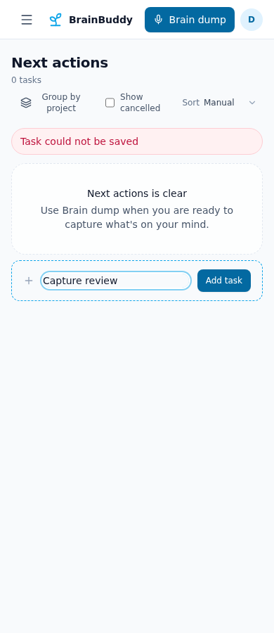
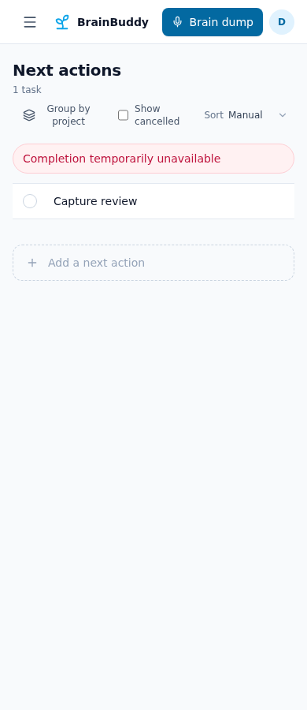
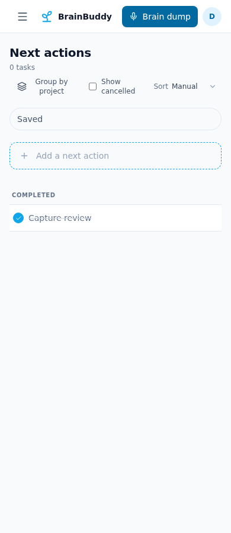

# Dogfood QA Report

**Target:** `http://127.0.0.1:5174/tasks/next?group=off` (isolated local frontend with synthetic API responses)
**Date:** 2026-09-24
**Scope:** Web task list and inline Task card: compact rows, keyboard focus, responsive widths, pagination, subtask/comment creation, task creation, completion and reopening
**Tester:** Hermes Agent

## Executive Summary

| Severity | Count |
|----------|-------|
| Critical | 0 |
| High | 1 |
| Medium | 1 |
| Low | 0 |
| **Total** | **2** |

**Categories:** Functional 1, UX 1; all other categories 0.

Both observed issues have been corrected locally and verified with regression tests and browser journeys. This is not production acceptance.

## Issues

### Issue #1: A failed subtask or comment submission erases its draft — fixed locally

| Field | Value |
|-------|-------|
| **Severity** | High |
| **Category** | Functional |
| **URL** | `http://127.0.0.1:5174/tasks/next/task-detail-qa?group=off` |

**Description:** Both creation forms called their mutation and immediately reset the input, before the server acknowledged the write. On failure, a user lost the entered subtask title or comment and had to reconstruct it manually. The failure was reproduced as a failing regression test for each form before the correction.

**Steps to Reproduce:**
1. Open a Task inline and type a new subtask or comment.
2. Press Enter while that create request returns an error.
3. Inspect the input and try again.

**Expected:** Keep the draft through failure, explain it inline, and clear only after acknowledged creation. Do not submit the same draft twice while a request is pending.

**Actual before fix:** The input cleared on submit even though the request failed.

**Verified after fix:** In a synthetic-browser 503 scenario, both drafts remained in their inputs and received inline alerts. Pressing Enter again succeeded and cleared each input; each endpoint was called twice. The 390 px Task card had no horizontal overflow. The browser console logged the two intentional HTTP 503 responses, but no uncaught JavaScript exception.

**Screenshot of corrected comment failure state:**

---

### Issue #2: Failed next-page request gives no recovery feedback — fixed locally

| Field | Value |
|-------|-------|
| **Severity** | Medium |
| **Category** | UX |
| **URL** | `http://127.0.0.1:5174/tasks/next?group=off` |

**Description:** The first page remained visible after a later page failed, but the list had no failure notice and its button still said “Load more tasks.” A user could mistake the incomplete result for a complete list or keep retrying without knowing whether the request failed. The existing automatic deep-link recovery handled its own page errors, but ordinary manual pagination did not.

**Steps to Reproduce:**
1. Open a task list whose first page has `next_cursor`.
2. Click “Load more tasks” while the next-page endpoint continues to fail after automatic retries.
3. Inspect the list footer and retry the request.

**Expected:** Explain the failed load without hiding existing rows; provide a clearly labeled retry and remove the error after success.

**Actual before fix:** Loaded rows remained; no visible error, and the button retained its normal label. The new regression test failed on the missing alert before the change.

**Verified after fix:** A `role="alert"` explains the failure, 12 loaded rows remain, and “Retry loading tasks” successfully adds a thirteenth row. At 390 px there is no horizontal overflow; no uncaught page errors were observed. The browser scenario used synthetic, non-user task data and a mocked 503 response.

**Screenshot of corrected failure state:**

**Console errors:** No uncaught JavaScript exceptions in the tested journey. The intentionally mocked HTTP 503 represents the error scenario.

## Issues Summary Table

| # | Title | Severity | Category | Status |
|---|-------|----------|----------|--------|
| 1 | Failed subtask or comment submission erases its draft | High | Functional | Fixed locally; pending release |
| 2 | Failed next-page request gives no recovery feedback | Medium | UX | Fixed locally; pending release |

## Testing Coverage

### Pages Tested
- `/tasks/next?group=off` at 1440 × 900, 768 × 900, and 390 × 900.
- `/tasks/next/task-1?group=off` inline detail at the same widths.
- `/tasks/next/task-detail-qa?group=off` at 390 × 900 and 1440 × 900.
- `/tasks/next?group=off` task capture, completion and reopen at 390 × 900 and 1440 × 900; `/tasks/waiting` and `/projects/project-qa` contextual capture at 390 × 900.

### Features Tested
- Twelve 44 px compact rows, long-title truncation, tag and due metadata, and no horizontal body overflow.
- Route-backed inline detail opening and keyboard focus visibility on sorting and completion controls.
- Next-page failure after exhausted retries, retained rows, error announcement, and successful retry.
- Subtask and comment creation failures, retained drafts, inline alerts, and successful resubmission.
- Blank task title: no request; failed creation: retained title and visible error; retry: same idempotency key and exactly one new row. Waiting capture blocks blank `waiting_for` and submits the trimmed value; project capture includes the active project ID.
- Keyboard row completion: three automatic 503 failures retain the open task and show an error; manual retry reuses its key, moves exactly one row to Completed, and preserves focus. Completed heading appears after the movement animation. Reopening from the card returns the task to Inbox, which the owner confirmed is acceptable; this shortcut remains unchanged.
- Frontend CI gate (`make ci-frontend`): 1085 Vitest tests, lint, typecheck, coverage floors, Allure taxonomy, and production build passed locally. A pending-write regression also verifies no double submission and preservation of newer typed text.

### Not Tested / Out of Scope
- Real backend, authentication, persistent writes, native mobile, agent handoff, production release journey. The API was mocked to avoid using account credentials or user data.
- Other task-list states, full search/filter matrix, and screen-reader narration were not exhaustively tested.
- Backend write persistence, ambiguous acknowledgements, and cross-device state convergence were not tested with the synthetic API.

### Blockers
- The browser automation endpoint rejected the private localhost URL, so a local Playwright Chromium session with isolated API fixtures was used instead. A real authenticated production QA pass and exact-SHA CI/release evidence remain outstanding.

## Notes

Desktop and narrow-view baselines:

Capture failure, completion failure and final completed presentation:

