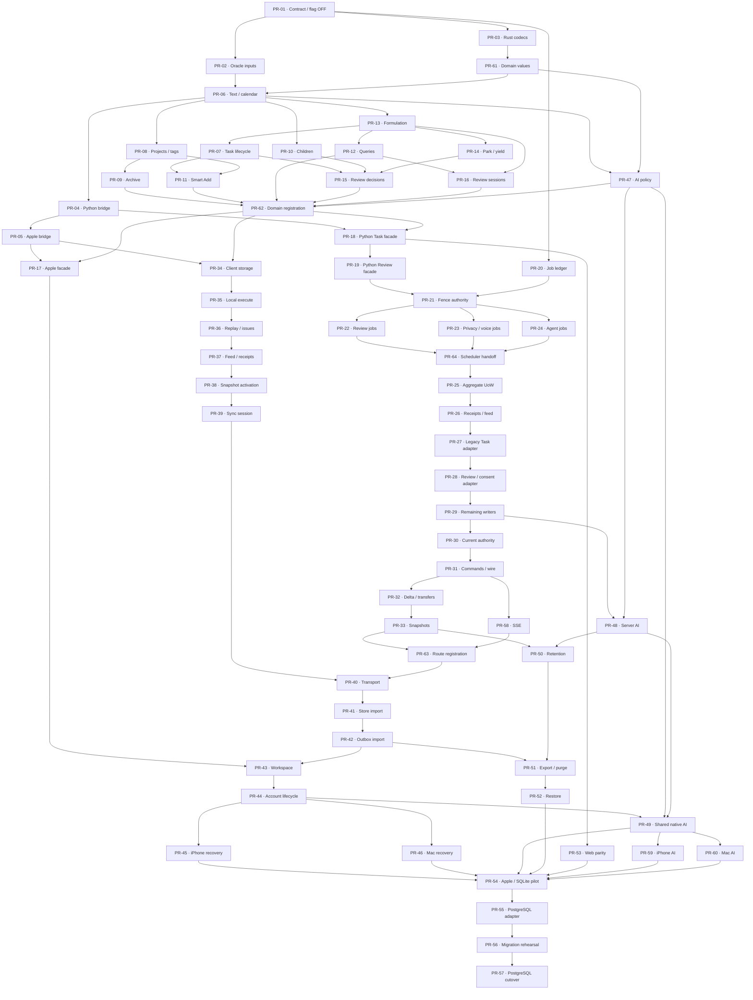

# PR dependency graph

Authoritative edges and ownership: [tasks.md](tasks.md). Each node is one task and one atomic PR. An arrow means the prerequisite must be accepted and merged before the dependent worker starts. Node numbers are stable identifiers, not a serial schedule. Start every ready independent node up to the available worker limit; land through the repository’s serialized gate.

The PR-62 and PR-63 joins only register already tested modules/routes. They may not absorb unfinished business logic. PR-64 owns the bounded worker loop and scheduler handoff; the independent adapter PRs keep the old schedulers active until it passes. PR-54 is the Apple/current-SQLite acceptance gate; PR-55…57 remain a separately authorized post-pilot migration.
