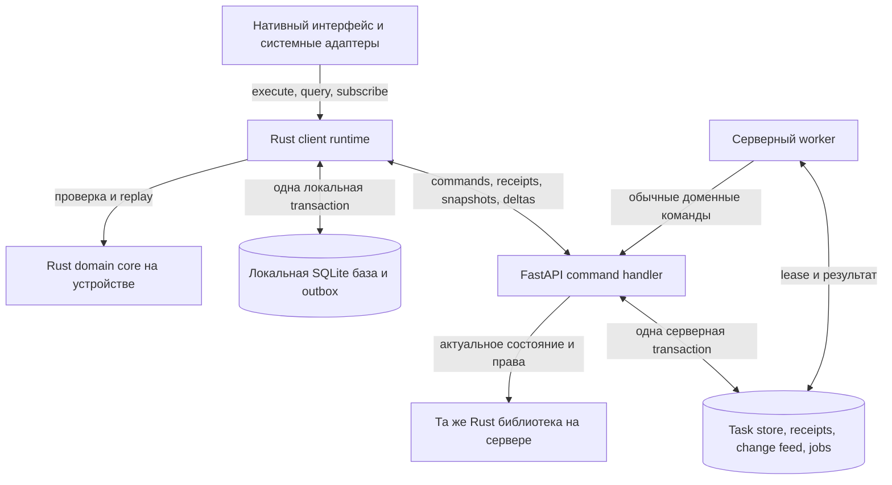
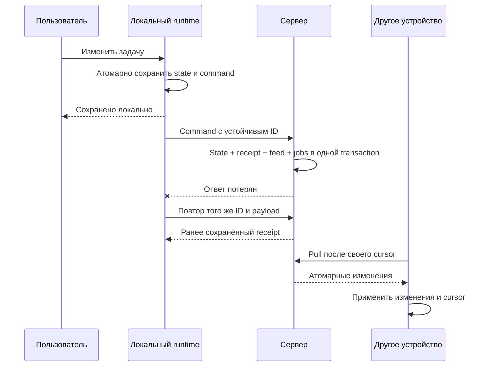

# Implementation Plan: общее Rust-ядро и собственная синхронизация

**Branch**: `026-rust-core-sync` | **Date**: 2026-10-08 | **Spec**: [spec.md](spec.md)

**Status**: техническое предложение к спецификации. Это не завершённый `/speckit-plan` и не допуск к реализации. [Design](design.md) предлагается для проверки; обязательные human design sign-off и formal planning review не подменены авторским решением. Очередность работ записана в [tasks.md](tasks.md).

## Summary

Rust должен заменить повторяющиеся правила и механизм локальной работы, сохранив нативный интерфейс каждой платформы. Сервер принимает команды и публикует изменения; устройство сначала сохраняет действие у себя и обменивается с сервером, когда доступна сеть. Пользователь не ждёт сетевого round trip для обычной записи задачи.

Общий код состоит из двух частей. **Domain core** решает, допустимо ли действие и как оно меняет доменные данные. **Client runtime** ведёт локальную базу, устойчивую очередь и синхронизацию. Сервер использует тот же domain core, но свой transaction adapter и актуальную авторизацию. Разделение не позволяет случайно унести HTTP, SQL, платформенный keychain или AI-engine внутрь правил задач.

Начальный backend остаётся FastAPI: Python вызывает Rust через PyO3. Это даёт общие правила без одновременной переписи Identity, голосовых операций, CRT и A2A. PostgreSQL — целевое хранилище серверных task transactions; перенос в него проводится отдельным этапом после проверки protocol на текущем single-writer SQLite. Замена FastAPI на Rust/Axum не является prerequisite и пока не планируется.

## Technical Context

| Область | Сейчас на базе `3b5967f` | Предлагается |
| --- | --- | --- |
| Apple-клиенты | SwiftUI, общий BrainBuddyKit, JSON store | Сохранить SwiftUI и workspace facade; под ним Rust core/runtime, SQLite |
| Правила | Swift, Python, часть TypeScript | Одна реализация Rust; web получает серверные решения и capabilities |
| Backend | FastAPI modular monolith, раздельные хранилища модулей | Тот же monolith; PyO3 domain bridge; отдельный worker process из того же кода |
| Sync | Последовательные REST writes, full pull, detail hydration | Command receipts, commit-ordered delta feed и consistent snapshot |
| CLI/MCP | HTTP-клиенты/серверные tools | Продолжают обычный серверный путь; новый local CLI store не добавляется |
| AI | Существующие local/cloud adapters и consent | Общая policy/proposal validation, платформенные inference adapters |

Rust stable/MSRV и точные версии UniFFI, PyO3, rusqlite/SQLite выбираются в проверочном вертикальном срезе и фиксируются lockfile. Номер версии «на глаз» не является архитектурным требованием. Существующие Python/Swift версии сохраняются на первом шаге. Rust CLI в `cli/` не становится общей библиотекой просто потому, что уже написан на Rust.

## Схема компонентов



Стрелка worker → command handler означает вызов application port внутри общего серверного кода, а не обязательный HTTP-запрос самому себе. Domain core компилируется отдельно в каждый процесс: ни клиентская запись, ни локальная проверка не вызывают удалённый «общий Rust-сервис».

## 1. Границы общего кода

| Компонент | Владеет | Не владеет |
| --- | --- | --- |
| `bb-domain` | GTD transitions, validation, normalization, Smart Add, archive, review/formulation rules, deterministic projections | I/O, SQLite, auth session, UI, модели AI |
| `bb-client` | Локальные transactions, confirmed/pending/issues, replay, sync state machine, migrations | Серверная авторизация и внешние эффекты |
| `bb-protocol` | Версионированные command/result/feed DTO, codecs и errors | Второй реализацией бизнес-правил |
| Native bindings | Крупные вызовы runtime, lifecycle, cancellation, OS scheduling, keychain и inference adapter | Переписанными правилами допустимости действия |
| Server transaction adapter | Identity/ACL, загрузка read set, блокировки, persistence, receipts/feed/job commit | Отдельной Python-копией GTD reducer |

Pure API имеет смысл `decide(state_subset, command, execution_inputs) → changes | domain_error`. Время, идентификаторы, разрешённые действия и versioned policy передаются явно. Сервер не доверяет policy flags из клиентского payload. Core возвращает намерение внутреннего эффекта; запуск сети происходит только после durable commit. Если проверка требует связанных проектов, уникальных имён или review settings, read set загружается и защищается в той же transaction.

Сохраняются Python-compatible NFKC, whitespace, полное Unicode case folding и подсчёт Unicode scalar values. `str::len()`, простой lowercase или другая календарная библиотека без parity-проверки не являются корректной заменой. Нормативные golden vectors берутся из существующих тестов; расхождения разрешаются по accepted ADR и принятому поведению, а не выбором случайной текущей реализации.

Общими становятся также команды widgets/intents и AI proposals. На платформе остаются доступность железа, доступ к микрофону, OS notifications, клавиатурные команды и отображение. Платформенные тесты остаются необходимы: общий reducer не проверяет Swift concurrency, JNI memory lifetime или suspend процесса.

## 2. Нативные платформы и FFI

| Платформа | UI и bridge | Почему и ограничение |
| --- | --- | --- |
| iOS и macOS | SwiftUI, UniFFI Swift, XCFramework | Два клиента уже имеют общий facade. Нужно доказать app/widget linking, signing, concurrency и Linux-testable часть kit |
| Android | Kotlin, Jetpack Compose, UniFFI/JNI | Сохраняются Android lifecycle и OS services; проверяются ABI, cancellation и фоновые ограничения |
| Windows | C# и WinUI 3, узкий стабильный C ABI/PInvoke | Предлагаемый baseline без зависимости от зрелости стороннего UniFFI C#; память освобождается через library API |
| Linux | Rust и GTK4 | Прямое использование runtime, меньше FFI. GTK естественнее для GNOME; интеграция KDE и packaging требуют отдельной проверки |
| Web | Существующий React-клиент и HTTP | Серверный core авторитетен; WASM нужен только при доказанной необходимости локальных правил, не добавляется в MVP |

Runtime предоставляет `execute(command)`, `query(query, page)`, `subscribe(changes)`, `sync_now()`, `cancel(operation)`, `close()`. DTO coarse-grained; UI не делает FFI-вызов на каждое поле. Calls, disk I/O и sync не блокируют main thread. Асинхронные completion доставляются в согласованный executor/dispatcher UI. Subscription имеет явный lifetime и coalescing: медленный экран получает invalidation и перечитывает query, а не бесконечную очередь full snapshots.

Ожидаемые ошибки передаются типизированным Result. Panic не пересекает FFI; boundary переводит его в безопасную внутреннюю ошибку, отменяет transaction и закрывает повреждённый runtime при невозможности продолжать. Raw pointers не передаются через высокоуровневый UI. Для C ABI каждый buffer/handle имеет единственного владельца и соответствующий release; двойной close безопасен. Credential хранится у OS adapter и не входит в domain DTO.

## 3. Локальная база и процессы

SQLite принадлежит runtime. Account-less workspace и каждый account имеют отдельные пути/идентичность; база аккаунта открывается только для соответствующего session generation. Credentials хранятся в Keychain/Keystore/OS secure store. OS file protection и TLS сохраняют текущую модель защиты; E2EE не заявляется.

WAL и транзакции координируют app/widget/intents между процессами. Один process-local actor недостаточен. Каждый write перечитывает необходимые версии после получения DB write lock. Миграция schema получает межпроцессный exclusive migration lock; старые процессы не пишут в неподдерживаемый epoch. Busy timeout ограничен; истечение даёт повторяемую ошибку без «успешно сохранено». Widget может выполнить разрешённую локальную команду через runtime, но сетевой sync принадлежит приложению. DB change generation и OS invalidation обновляют проекции соседних процессов.

`confirmed_records`, `outbox`, `command_receipts`, `sync_issues`, `drafts`, `sync_meta`, `identity_aliases` и необходимые local-only review records составляют модель хранения. `visible_state` можно материализовать для быстрых queries, но это восстановимая проекция, не вторая истина. Индексы owner/list/project/tag и pagination предотвращают передачу 10 000 задач при каждом нажатии. Загрузка AI weights не проходит через task DB.

## 4. Протокол и конфликтная модель

Полный контракт находится в [contracts/sync-v1.md](contracts/sync-v1.md); он нормативен для proposed v1. Основной путь:



MVP использует ожидаемую edit revision сущности и явно сохраняет конфликты. Это предсказуемее общего LWW и проще проверить, чем изобретать свой CRDT. Цена — конфликт возможен даже для независимых полей. Автоматическое field merge допустимо позже только с проверкой field base values и всего доменного инварианта. Особое auto-park yield существующего review применяется уже в v1.

UX реализует состояния [design.md](design.md): статус M-01/D-01, разрешение M-02/D-02, восстановление M-03/D-03. Предлагаемые экраны не добавляют режим управления инфраструктурой: человеку нужны сохранность, причина задержки и следующее действие.

## 5. Сервер и фоновые задания

API и worker запускаются отдельными процессами одного modular monolith. PostgreSQL target хранит task aggregate, receipts, per-scope feed и job/effect outbox в одной DB transaction. Identity, CRT и другие модули сохраняют собственное владение; упоминание PostgreSQL не означает автоматический перенос их данных. Для межмодульных и внешних операций остаётся operation/saga contract, нельзя объявить file + SQLite + network одной ACID transaction.

Job содержит тип, scope, dedup key, payload reference, run_at, status, attempts, lease owner/until, fencing generation и last safe error. Worker берёт lease атомарно; heartbeat продлевает его. Результат принимается только с текущим generation. Повторы ограничены, backoff с jitter, исчерпанные попытки становятся видимым failed state. Отмена проверяется перед эффектом и при result commit; уже отправленный внешнему провайдеру эффект нельзя гарантированно отозвать.

Внутренний эффект вызывает обычную command с устойчивым effect ID; retry не создаёт вторую мутацию. Внешнему сервису передаётся его поддерживаемый idempotency key; при timeout используются lookup/reconciliation, как в существующем A2A. Если сервис не даёт ни дедупликации, ни lookup, неопределённый исход требует решения, а не бесконечных повторов. Lease fencing само по себе не отменяет уже ушедший HTTP-запрос.

Переносятся существующие maintenance обязанности: auto-park, recovery операций, retention и agent observation. Список обязанностей и cadence фиксируются перед выключением старых threads. На переходе один механизм владеет конкретным заданием; два scheduler одновременно не запускаются без общей dedup/lease. Нативное локальное напоминание и серверная работа — разные механизмы. Для account-less auto-park сохраняется текущая локальная authority ADR-0027.

Время различает date-only, UTC instant и wall-clock с IANA timezone. Для существующего Weekly Review сохраняются floors, acknowledgement и DST правила. Будущая recurrence потребует отдельного product contract: due-based/completion-based, DST ambiguity, catch-up и occurrence identity; spec 026 не создаёт её молча.

## 6. AI и агенты

Общий слой принимает capability request и privacy policy. Сначала используется детерминированный код, если задача уже решается правилами; затем подходящий локальный engine; затем только разрешённый сервер/внешний provider. Доступность означает подходящий язык, формат ответа, память и условия запуска, а не только установленный пакет. Локальная модель не обязана быть одна на всех платформах.

Apple Foundation Models, Android OS models и собственный runtime наподобие llama.cpp — адаптеры, выбираемые после проверки конкретных устройств и языка. Архитектура не обещает поддержку русского языка или наличие системной модели на каждом телефоне. Вес модели, лицензия, RAM/KV cache, battery/thermal limits, download/checksum/version и очистка storage входят в выбор конкретного engine. Это отдельные оценки, не причины переписывать domain core.

Раздельные права: cloud task sync; обработка на собственном сервере; передача выбранному внешнему provider. «Только на устройстве» всегда запрещает remote inference, включая fallback при ошибке. Server credentials никогда не попадают в клиентскую DB. Общая policy задаёт budget, timeout, cancellation, output schema и разрешённый набор команд. Адаптер возвращает Proposal с provenance; подтверждение проходит обычный command pipeline и не обходит ACL/revisions. UX M-04/D-04 использует существующий consent contract, не выдаёт одно вечное согласие на всех провайдеров.

Task и AgentRun остаются разными сущностями. Existing A2A/MCP flows сохраняются, агент ограничен capability, scope, budget и deadline. Недоверенный документ не может выдать себе права. Run success возвращает evidence/proposal, а завершение задачи остаётся отдельной Tasks command. Новый A2A marketplace, delegation и автономное перепоручение в этот этап не входят.

## 7. Миграция без параллельных источников истины

1. **Нормативная база.** Инвентаризировать команды и все writers, реальную схему и accepted правила. Сопоставить golden vectors Swift/Python/TS; исправление противоречия требует отдельного решения, не скрытого «рефакторинга».
2. **Вертикальный срез.** Создание/переход/validation через один Rust core на Apple и Python; доказать bridge, Linux package boundary, error/lifetime и release packaging. Сравнение старого и нового reducer идёт в shadow без двойной записи. После parity у правила остаётся один writer.
3. **Общее доменное поведение.** Перенести normalization, Smart Add, queries, archive, children, review и clocks. Пока runtime может использовать старые transport/store adapters. Веб перестаёт быть независимым authority: derived отображение либо серверная projection, либо явно versioned shared vectors до удаления дублирования.
4. **Серверный sync contract.** Сначала расширить durable receipts и подключить все writers к feed; добавить capabilities/snapshot/delta. Legacy adapter сохраняет response shapes и deterministic mapping старого `(owner, method, route, key digest)` к command receipt. Поздние legacy повторы не должны обходить новую дедупликацию.
5. **Локальное хранение и новый sync.** Под migration lock сделать backup исходного JSON и schema manifest, импортировать в staging DB, проверить ID/связи/counts/replay, затем атомарно переключить marker. Сохранить локальные IDs и mapping к server IDs: сегодняшнее API не принимает ordinary client IDs. Для новых команд новый endpoint принимает заранее созданный ID, для старых работает alias table. Existing `everSent`, issuedAt, attempts, key/body, uncertain status, review marks и drafts не теряются.
6. **Разбор старой uncertainty.** До переключения получить доступные receipts старых отправок. Старые записи за 24-часовым окном без доказуемого исхода не перевыпускаются с новым ID. Они остаются issue с текстом и явной сверкой; эвристика title/list/time не считается доказательством. Новый протокол не может задним числом восстановить уже удалённый receipt. Пока есть такие записи, миграция не заявляет «всё синхронизировано».
7. **PostgreSQL отдельно.** После protocol acceptance выполнить остановку task writers, согласованный перенос aggregate+receipts+feed+jobs, сверку и переключение единого authority. Identity/CRT не переносятся в этом шаге. Нет rolling overlap двух task DB writers. Записать новый storage epoch, permitted rollback image и план forward repair.
8. **Новые платформы.** Android первым как проверка переносимости вне Apple; затем Windows и Linux. Каждая получает capture/offline/conflict/recovery и device-specific checks, а не копию reducer. Это последовательность предложения, срок всего проекта пока не оценён.

Backup содержит базу, receipts, feed watermark/generation и job ledger согласованно. После restore новая server/feed generation заставляет клиентов rebootstrap с сохранением pending и отбрасыванием старых ответов; реестр внешних эффектов сверяется отдельно. До открытия доступа применяются последующие purge/revocation решения из control ledger вне откатываемого task backup. Нельзя воскресить удалённый аккаунт или отозванную сессию; если полнота сверки не доказана, сервис остаётся закрытым. RPO/RTO и backup/WAL policy проверяются до cutover; потерянные подтверждённые commits нельзя скрыть обычным reset. Старый binary нельзя просто направить в новую DB. Feature flag OFF прекращает exposure, но не откатывает irreversible schema. Существующие sign-out, account deletion grace/purge/export должны знать новые категории данных и backup retention; прежние pre-upgrade backup обязательства spec 021 сохраняются.

## 8. Проверка и эксплуатация

Повторно используются formulation vectors, project archive traces, reducer/replay/sync tests BrainBuddyKit, backend task/review/idempotency suites и compatibility tests. Они становятся parity oracle для Rust. Не нужно переписывать каждый тест на каждом языке: общие rules проверяются в Rust; binding smoke проверяет сериализацию, ошибки и вызов на платформе.

Новая необходимая проверка — protocol fault harness с управляемыми crash boundaries, потерей/повтором/перестановкой сообщений, concurrency, snapshot expiry и restore. Обязательные случаи перечислены в contract §10. До реализации критических durability/dedup/owner invariants тест должен показать отказ. FFI/storage/schema/platform integration проверяются отдельно там, где shared unit test не может обнаружить ошибку. AI evaluation остаётся per capability/language/runtime/device, поскольку модели разные.

Метрики без содержимого: command latency, oldest pending age, sync lag от server commit, retry rate, conflict rate, lease age, failed jobs, reset count. Correlation ID проходит API→receipt→job; текст и fingerprints отсутствуют в logs. Runtime telemetry передаётся только в рамках принятой политики диагностик.

| Сигнал | Предлагаемый порог | Владелец и действие |
| --- | --- | --- |
| Нарушение dedup/owner invariant | Любой подтверждённый случай | Maintainer релиза останавливает rollout/writes затронутого scope и расследует по безопасным IDs |
| Foreground sync latency | p95 > 2 с 15 минут при SC-004 условиях | Maintainer проверяет API/DB/hint, оставляет fallback pull; не сбрасывает очереди |
| Worker backlog | Просрочка > 5 минут 10 минут подряд, кроме явно отложенных jobs | Maintainer проверяет leases, нагрузку, dead letters; повторяет только безопасные jobs |
| Повторные local migration failures | Любой необъяснённый failure в pilot | Остановить расширение cohort, сохранить исходные данные, выпускать forward fix |

Сначала pilot на существующих Apple-клиентах. Новый sync выключен по умолчанию для неготового scope; старый путь остаётся единственным writer до cutover. Гейт выпуска: frozen acceptance, formal review, согласованный PR-slice map, relevant native/backend/web CI, exact-SHA gates и migration/recovery drill. Эта документационная работа не выполняет продуктовый release и не притворяется evidence этих гейтов.

## Constitution Check

- Consent/local-first: FR-001/018–022, отдельные разрешения sync и AI, сохранение ADR-0002.
- Contract ownership: module boundaries ADR-0001 и Tasks review ADR-0027 сохранены; storage/FFI изменения требуют [adr-draft.md](adr-draft.md).
- Tests: существующие parity tests + только отсутствующие protocol/FFI/migration invariants; стратегия выше следует Principle II.
- Observability: FR-023 и таблица сигналов, no-content diagnostics, current correlation IDs.
- Mobile/CRT: UI не ждёт сеть; ограниченный background; CRT storage/protocol остаются прежними, perf regression проверяется существующим сценарием.
- Design: [design.md](design.md), M-01…M-04/D-01…D-04; human sign-off pending. Это причина статуса proposal, не выдуманное approval.
- Delivery: isolated worktree; документы не разрешают продуктовые миграции. Formal five-lens review и agreed PR slices остаются до implementation.

## Project Structure

Предлагаемые новые пути, которых пока нет в продукте:

```text
rust/Cargo.toml
rust/crates/bb-domain/
rust/crates/bb-protocol/
rust/crates/bb-client/
rust/bindings/swift/
rust/bindings/python/
rust/bindings/kotlin/
rust/bindings/c/
backend/app/modules/tasks/rust_adapter.py
backend/app/modules/tasks/sync/
```

Existing integration points: `ios/BrainBuddyKit/Sources/BrainBuddy{Core,Persistence,Sync,Workspace}`, `macos/Package.swift`, `backend/app/modules/tasks/{service.py,repository.py}`, `backend/app/container.py`, `backend/app/main.py`. Названия новых crates — предложение ownership, не требование создавать пустые abstractions заранее. Kotlin/C bridges добавляются при платформенном этапе.

## Решения, которые ещё не приняты за пользователя

Нужно принять новые conflict/recovery UX и узкое изменение accepted ADR перед реализацией. E2EE, shared spaces/assignee и порядок выпуска после Apple остаются отдельными продуктовыми решениями; предложенный baseline позволяет разрабатывать приватный trusted-server sync без выдумывания их семантики. Целевые устройства/нагрузка и retention/compatibility defaults фиксируются в первом contract slice по результатам измерений и проверки существующих ограничений.
