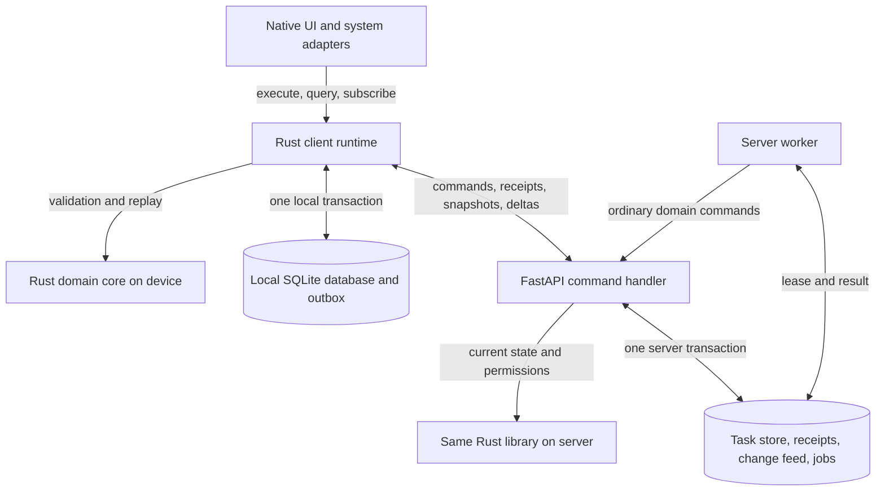
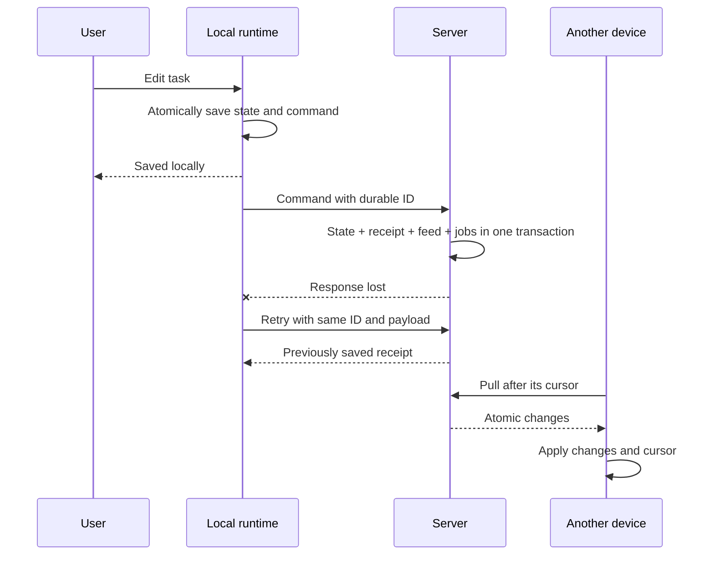

# Implementation Plan: Shared Rust Core and Native Sync

**Branch**: `026-rust-core-sync` | **Date**: 2026-10-08 | **Spec**: [spec.md](spec.md)

**Status**: Technical proposal for the specification. This is not a completed `/speckit-plan` and does not authorize implementation. [Design](design.md) is proposed for review; the required human design sign-off and formal planning review have not been replaced by the author's decision. Work order is recorded in [tasks.md](tasks.md).

## Summary

Rust should replace duplicated rules and local-work mechanisms while preserving each platform's native interface. The server accepts commands and publishes changes; the device first saves an action locally and exchanges it with the server when a network is available. The user does not wait for a network round trip to perform an ordinary task write.

The shared code has two parts. **Domain core** decides whether an action is allowed and how it changes domain data. **Client runtime** manages the local database, durable queue, and synchronization. The server uses the same domain core, but its own transaction adapter and current authorization. This separation prevents HTTP, SQL, the platform keychain, or an AI engine from accidentally entering task rules.

The initial backend remains FastAPI: Python calls Rust through PyO3. This provides shared rules without rewriting Identity, voice operations, CRT, and A2A at the same time. PostgreSQL is the target store for server-side task transactions; migration to it is a separate stage after validating the protocol on the current single-writer SQLite. Replacing FastAPI with Rust/Axum is not a prerequisite and is not currently planned.

## Technical Context

| Area | Current, based on `3b5967f` | Proposed |
| --- | --- | --- |
| Apple clients | SwiftUI, shared BrainBuddyKit, JSON store | Keep SwiftUI and workspace facade; add Rust core/runtime and SQLite underneath |
| Rules | Swift, Python, some TypeScript | One Rust implementation; web receives server decisions and capabilities |
| Backend | FastAPI modular monolith, separate module stores | Same monolith; PyO3 domain bridge; separate worker process from the same code |
| Sync | Sequential REST writes, full pull, detail hydration | Command receipts, commit-ordered delta feed, and consistent snapshot |
| CLI/MCP | HTTP clients/server tools | Continue on the ordinary server path; no new local CLI store |
| AI | Existing local/cloud adapters and consent | Shared policy/proposal validation, platform inference adapters |

Rust stable/MSRV and exact UniFFI, PyO3, rusqlite/SQLite versions are selected in a validation vertical slice and pinned in the lockfile. A version number chosen by guesswork is not an architectural requirement. Existing Python/Swift versions remain in the first step. The Rust CLI in `cli/` does not become a shared library merely because it is already written in Rust.

## Component Diagram



The worker → command-handler arrow means a call to an application port inside the shared server code, not a mandatory HTTP request to itself. The domain core is compiled separately into each process: neither client writes nor local validation call a remote “shared Rust service.”

## 1. Shared-Code Boundaries

| Component | Owns | Does not own |
| --- | --- | --- |
| `bb-domain` | GTD transitions, validation, normalization, Smart Add, archive, review/formulation rules, deterministic projections | I/O, SQLite, auth session, UI, AI models |
| `bb-client` | Local transactions, confirmed/pending/issues, replay, sync state machine, migrations | Server authorization and external effects |
| `bb-protocol` | Versioned command/result/feed DTOs, codecs, and errors | A second implementation of business rules |
| Native bindings | Coarse-grained runtime calls, lifecycle, cancellation, OS scheduling, keychain, and inference adapter | Reimplemented rules for whether an action is allowed |
| Server transaction adapter | Identity/ACL, read-set loading, locks, persistence, receipts/feed/job commit | A separate Python copy of the GTD reducer |

The pure API has the semantics `decide(state_subset, command, execution_inputs) → changes | domain_error`. Time, identifiers, permitted actions, and versioned policy are passed explicitly. The server does not trust policy flags from the client payload. The core returns an intent for an internal effect; network activity starts only after durable commit. If validation requires related projects, unique names, or review settings, the read set is loaded and protected in the same transaction.

Python-compatible NFKC, whitespace handling, full Unicode case folding, and Unicode scalar-value counting are preserved. `str::len()`, simple lowercase, or another calendar library without a parity check is not a correct replacement. Normative golden vectors come from existing tests; discrepancies are resolved according to accepted ADRs and accepted behavior, not by choosing whichever implementation happens to be current.

Widget/intent commands and AI proposals also become shared. Platform-specific responsibilities remain hardware availability, microphone access, OS notifications, keyboard commands, and rendering. Platform tests remain necessary: a shared reducer does not test Swift concurrency, JNI memory lifetime, or process suspension.

## 2. Native Platforms and FFI

| Platform | UI and bridge | Rationale and limitation |
| --- | --- | --- |
| iOS and macOS | SwiftUI, UniFFI Swift, XCFramework | The two clients already share a facade. App/widget linking, signing, concurrency, and the Linux-testable part of the kit must be proven |
| Android | Kotlin, Jetpack Compose, UniFFI/JNI | Preserve Android lifecycle and OS services; validate ABI, cancellation, and background limits |
| Windows | C# and WinUI 3, narrow stable C ABI/PInvoke | Proposed baseline avoids depending on the maturity of third-party UniFFI C#; memory is released through the library API |
| Linux | Rust and GTK4 | Direct runtime use, less FFI. GTK is a more natural fit for GNOME; KDE integration and packaging need separate validation |
| Web | Existing React client and HTTP | Server core is authoritative; WASM is needed only if local rules are demonstrably necessary and is not added to the MVP |

The runtime exposes `execute(command)`, `query(query, page)`, `subscribe(changes)`, `sync_now()`, `cancel(operation)`, and `close()`. DTOs are coarse-grained; the UI does not make an FFI call for every field. Calls, disk I/O, and sync do not block the main thread. Async completions are delivered on the agreed UI executor/dispatcher. A subscription has an explicit lifetime and coalescing: a slow screen receives invalidation and rereads the query instead of accumulating an endless queue of full snapshots.

Expected errors are returned as typed Results. Panics do not cross FFI; the boundary converts them into a safe internal error, rolls back the transaction, and closes the damaged runtime if it cannot continue. Raw pointers are not passed through high-level UI. In the C ABI, each buffer/handle has a single owner and a matching release; double close is safe. Credentials stay in the OS adapter and are not included in domain DTOs.

## 3. Local Database and Processes

The runtime owns SQLite. An account-less workspace and each account have separate paths/identities; an account database opens only for the corresponding session generation. Credentials are stored in Keychain/Keystore/OS secure storage. OS file protection and TLS preserve the current protection model; end-to-end encryption (E2EE) is not claimed.

WAL and transactions coordinate the app/widget/intents across processes. One process-local actor is not sufficient. Each write rereads the required versions after obtaining the DB write lock. A schema migration obtains an interprocess exclusive migration lock; old processes do not write to an unsupported epoch. Busy timeout is bounded; expiration returns a retryable error rather than reporting “saved successfully.” A widget may run an allowed local command through the runtime, but network sync belongs to the app. DB change generation and OS invalidation update projections in neighboring processes.

`confirmed_records`, `outbox`, `command_receipts`, `sync_issues`, `drafts`, `sync_meta`, `identity_aliases`, and required local-only review records form the storage model. `visible_state` may be materialized for fast queries, but it is a rebuildable projection, not a second source of truth. Owner/list/project/tag indexes and pagination prevent sending 10,000 tasks on every tap. AI weight loading does not go through the task DB.

## 4. Protocol and Conflict Model

The full contract is in [contracts/sync-v1.md](contracts/sync-v1.md); it is normative for the proposed v1. The main path is:



The MVP uses an expected entity edit revision and preserves conflicts explicitly. This is more predictable than general LWW and easier to verify than inventing a CRDT. The cost is that even independent fields can conflict. Automatic field merge may be added later only with field base-value checks and validation of the full domain invariant. The existing special auto-park yield for review applies in v1.

UX implements the states in [design.md](design.md): status M-01/D-01, resolution M-02/D-02, recovery M-03/D-03. The proposed screens do not add an infrastructure-management mode: users need to know their work is preserved, why it is delayed, and what to do next.

## 5. Server and Background Jobs

The API and worker run as separate processes in one modular monolith. The PostgreSQL target stores task aggregates, receipts, the per-scope feed, and the job/effect outbox in one DB transaction. Identity, CRT, and other modules retain their ownership; mentioning PostgreSQL does not mean their data moves automatically. Cross-module and external operations retain the operation/saga contract; a file + SQLite + network operation cannot be declared one ACID transaction.

A job contains type, scope, dedup key, payload reference, run_at, status, attempts, lease owner/until, fencing generation, and last safe error. The worker acquires a lease atomically; heartbeat extends it. A result is accepted only with the current generation. Retries are bounded with jittered backoff; exhausted attempts become a visible failed state. Cancellation is checked before the effect and at result commit; an effect already sent to an external provider cannot be reliably recalled.

An internal effect calls an ordinary command with a durable effect ID; retry does not create a second mutation. An external service receives its supported idempotency key; timeout handling uses lookup/reconciliation, as in existing A2A. If a service supports neither deduplication nor lookup, an unknown outcome requires a decision, not endless retries. Lease fencing by itself does not cancel an HTTP request already sent.

Existing maintenance responsibilities move over: auto-park, operation recovery, retention, and agent observation. Their list and cadence are recorded before old threads are disabled. During transition, one mechanism owns each specific job; two schedulers do not run at once without shared dedup/lease. Native local reminders and server jobs are separate mechanisms. Existing local authority for account-less auto-park is preserved under ADR-0027.

Time distinguishes date-only values, UTC instants, and wall-clock values with an IANA timezone. Existing Weekly Review floors, acknowledgement, and DST rules are preserved. Future recurrence requires a separate product contract: due-based/completion-based behavior, DST ambiguity, catch-up, and occurrence identity; spec 026 does not add it silently.

## 6. AI and Agents

The shared layer accepts a capability request and privacy policy. Deterministic code is used first when rules already solve the task; then an appropriate local engine; then only an authorized server/external provider. Availability means suitable language, response format, memory, and runtime conditions, not merely an installed package. There need not be one local model across all platforms.

Apple Foundation Models, Android OS models, and a custom runtime such as llama.cpp are adapters, selected after checking specific devices and languages. The architecture does not promise Russian-language support or a system model on every phone. Model weights, license, RAM/KV cache, battery/thermal limits, download/checksum/version, and storage cleanup are part of selecting a specific engine. These are separate evaluations, not reasons to rewrite the domain core.

Permissions remain separate: cloud task sync; processing on our server; transfer to a selected external provider. “On-device only” always prohibits remote inference, including fallback on error. Server credentials never enter the client DB. Shared policy sets budget, timeout, cancellation, output schema, and allowed commands. An adapter returns a Proposal with provenance; confirmation goes through the ordinary command pipeline and does not bypass ACLs/revisions. UX M-04/D-04 uses the existing consent contract and does not grant one perpetual consent for all providers.

Task and AgentRun remain separate entities. Existing A2A/MCP flows are preserved; an agent is limited by capability, scope, budget, and deadline. An untrusted document cannot grant itself permissions. A successful run returns evidence/proposal, and task completion remains a separate Tasks command. A new A2A marketplace, delegation, and autonomous reassignment are out of scope for this stage.

## 7. Migration Without Parallel Sources of Truth

1. **Normative baseline.** Inventory commands, all writers, the actual schema, and accepted rules. Compare Swift/Python/TS golden vectors; correcting a contradiction requires a separate decision, not a hidden “refactor.”
2. **Vertical slice.** Run creation/transition/validation through one Rust core on Apple and Python; prove the bridge, Linux package boundary, errors/lifetime, and release packaging. Compare old and new reducers in shadow mode without double writes. After parity, each rule has one writer.
3. **Shared domain behavior.** Move normalization, Smart Add, queries, archive, children, review, and clocks. The runtime may still use old transport/store adapters. Web ceases to be an independent authority: derived display or a server projection is used, or explicitly versioned shared vectors remain until duplication is removed.
4. **Server sync contract.** Complete T012's durable job adapter, execution authority, and lease/fencing checks through the existing compatible task ports before T007 connects internal writers to the new boundary. Keep one scheduler owner through that handoff. Then extend durable receipts and connect all writers to the feed; add capabilities/snapshot/delta. No sync pilot may start until auto-park/jobs and every other writer publish through the shared receipt/feed transaction with their required authority checks. The legacy adapter preserves response shapes and deterministically maps the existing owner/idempotency-key identity to one command receipt. Command/route and body remain conflict checks after lookup; changing the operation or transport must not create a new replay namespace. Late legacy retries must not bypass new deduplication.
5. **Local storage and new sync.** Under a migration lock, back up the source JSON and schema manifest, import into a staging DB, verify IDs/relations/counts/replay, then atomically switch the marker. Preserve local IDs and their mapping to server IDs: today's API does not accept ordinary client IDs. For new commands, the new endpoint accepts a pre-created ID; old commands use an alias table. Existing `everSent`, issuedAt, attempts, key/body, uncertain status, review marks, and drafts are retained.
6. **Resolve old uncertainty.** Before switching, retrieve available receipts for old sends. Old records outside the 24-hour window without a provable outcome are not reissued under a new ID. They remain issues with their text and explicit reconciliation; heuristics based on title/list/time are not proof. The new protocol cannot retroactively restore an already-deleted receipt. While such records exist, migration does not claim “fully synced.”
7. **PostgreSQL separately.** After protocol acceptance, stop task writers, move aggregate+receipts+feed+jobs consistently, reconcile, and switch the single authority. Identity/CRT do not move in this step. There is no rolling overlap of two task DB writers. Record the new storage epoch, permitted rollback image, and forward-repair plan.
8. **New platforms.** Android first as a portability check outside Apple, then Windows and Linux. Each gets capture/offline/conflict/recovery and device-specific checks, not a copy of the reducer. This is a proposed sequence; the total project duration has not been estimated.

The backup consistently contains the database, receipts, feed watermark/generation, and job ledger. After restore, a new server/feed generation forces clients to rebootstrap while preserving pending work and discarding stale responses; external effects are reconciled separately. Before access is reopened, subsequent purge/revocation decisions from the control ledger outside the rollback-prone task backup are applied. A deleted account or revoked session must not be resurrected; if reconciliation completeness cannot be proven, the service remains closed. RPO/RTO and backup/WAL policy are validated before cutover; lost confirmed commits cannot be hidden by an ordinary reset. An old binary cannot simply be pointed at the new DB. Feature flag OFF stops exposure but does not roll back an irreversible schema. Existing sign-out, account deletion grace/purge/export must account for new data categories and backup retention; the previous pre-upgrade backup obligations in spec 021 remain.

## 8. Validation and Operations

Reuse formulation vectors, project archive traces, BrainBuddyKit reducer/replay/sync tests, backend task/review/idempotency suites, and compatibility tests. These become the parity oracle for Rust. Every test need not be rewritten in every language: shared rules are checked in Rust; binding smoke tests check serialization, errors, and calls on each platform.

The new required check is a protocol fault harness with controlled crash boundaries, message loss/retry/reordering, concurrency, snapshot expiry, and restore. Required cases are listed in contract §10. Before implementation, tests must demonstrate failure for critical durability/dedup/owner invariants. FFI/storage/schema/platform integration is checked separately where a shared unit test cannot detect a fault. AI evaluation remains per capability/language/runtime/device because the models differ.

Metrics contain no content: command latency, oldest pending age, sync lag from server commit, retry rate, conflict rate, lease age, failed jobs, and reset count. Correlation ID passes through API→receipt→job; text and fingerprints are absent from logs. Runtime telemetry is transmitted only under the accepted diagnostics policy.

| Signal | Proposed threshold | Owner and action |
| --- | --- | --- |
| Dedup/owner invariant violation | Any confirmed case | Release maintainer stops rollout/writes for the affected scope and investigates using safe IDs |
| Foreground sync latency | p95 > 2 s for 15 minutes under SC-004 conditions | Maintainer checks API/DB/hint and keeps fallback pull; does not clear queues |
| Worker backlog | Delay > 5 minutes for 10 consecutive minutes, except explicitly deferred jobs | Maintainer checks leases, load, and dead letters; retries only safe jobs |
| Repeated local migration failures | Any unexplained failure in pilot | Stop cohort expansion, preserve source data, and ship a forward fix |

Start with a pilot on existing Apple clients. New sync is off by default for an unready scope; the old path remains the sole writer until cutover. Release gate: frozen acceptance, formal review, agreed PR-slice map, relevant native/backend/web CI, exact-SHA gates, and migration/recovery drill. This documentation work does not perform a product release or claim evidence for these gates.

## Constitution Check

- Consent/local-first: FR-001/018–022, separate sync and AI permissions, ADR-0002 preserved.
- Contract ownership: module boundaries in ADR-0001 and Tasks review behavior/content limits in ADR-0027 preserved; storage/FFI and content-free command-metadata retention changes require [adr-draft.md](adr-draft.md).
- Tests: existing parity tests plus only missing protocol/FFI/migration invariants; the strategy above follows Principle II.
- Observability: FR-023 and signal table, no-content diagnostics, current correlation IDs. Constitution IV's broad client-ID restriction needs the narrow proposed command-identity amendment in `adr-draft.md`; T001 must obtain acceptance and update dependent documents before implementation. Dedicated command deduplication IDs never grant authority and remain separate from observability IDs.
- Mobile/CRT: UI does not wait for network; background work is bounded; CRT storage/protocol remain unchanged, and performance regression is checked by the existing scenario.
- Design: [design.md](design.md), M-01…M-04/D-01…D-04; human sign-off pending. This is why the status is proposal, not invented approval.
- Delivery: isolated worktree; documents do not authorize product migrations. Formal five-lens review and agreed PR slices remain required before implementation.

## Project Structure

Proposed new paths that do not yet exist in the product:

```text
rust/Cargo.toml
rust/crates/bb-domain/
rust/crates/bb-protocol/
rust/crates/bb-client/
rust/bindings/swift/
rust/bindings/python/
rust/bindings/kotlin/
rust/bindings/c/
backend/app/modules/tasks/rust_adapter.py
backend/app/modules/tasks/sync/
```

Existing integration points: `ios/BrainBuddyKit/Sources/BrainBuddy{Core,Persistence,Sync,Workspace}`, `macos/Package.swift`, `backend/app/modules/tasks/{service.py,repository.py}`, `backend/app/container.py`, `backend/app/main.py`. New crate names propose ownership; they are not a requirement to create empty abstractions in advance. Kotlin/C bridges are added during their platform stages.

## Decisions Not Yet Made on the User's Behalf

The new conflict/recovery UX, narrow changes to accepted ADRs, and the proposed Constitution IV command-identity amendment must be accepted before implementation. E2EE, shared spaces/assignees, and release order after Apple remain separate product decisions; the proposed baseline allows development of private trusted-server sync without inventing their semantics. Target devices/load and retention/compatibility defaults are fixed in the first contract slice based on measurements and validation of existing constraints.
